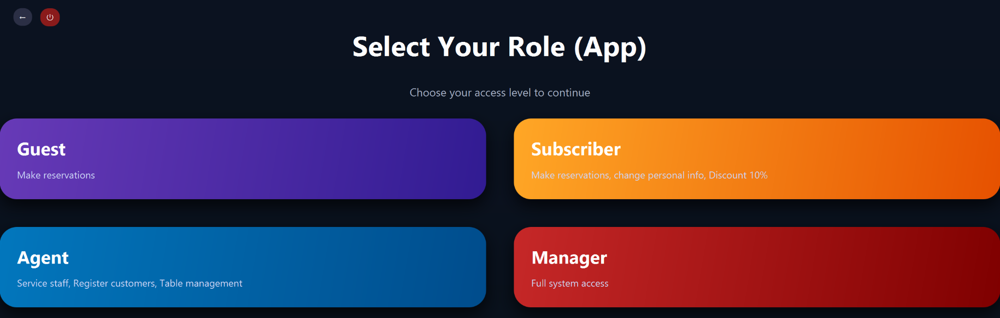
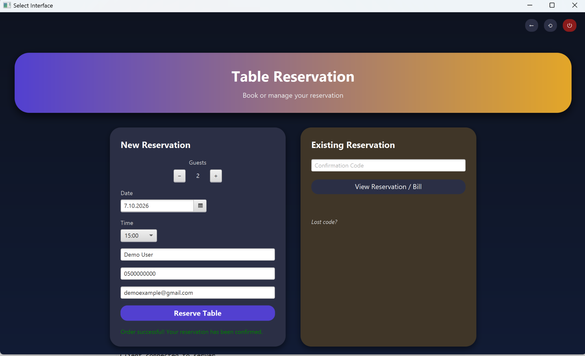
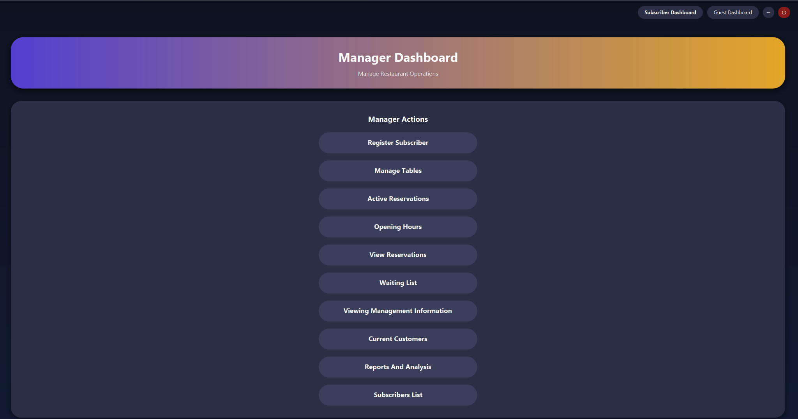
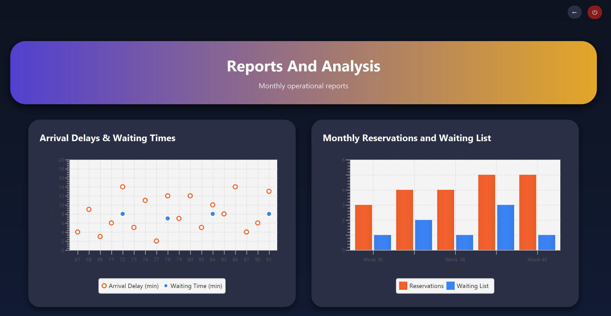

# Bistro Restaurant Management System

Bistro is a client-server restaurant management system developed with Java, JavaFX, OCSF, and MySQL.

The application manages the restaurant reservation workflow and provides dedicated interfaces for guests, subscribers, restaurant staff, and managers.

This repository contains a cleaned and organized portfolio version of an academic team project.

## Features

### Guest & Subscriber
- Create restaurant reservations
- View and manage reservations
- Join the restaurant waiting list
- Subscriber authentication and account management
- QR-based subscriber identification
- View personal information and visit history
- Complete reservation payments

### Restaurant Staff
- Register subscribers
- View active reservations
- View current customers
- Manage waiting lists
- Manage restaurant tables
- Access reservation information

### Manager
- Full management dashboard
- Configure restaurant opening hours
- Manage tables
- View reservations and waiting lists
- View subscribers and current customers
- Access reports and restaurant statistics

## User Roles

The system provides four access levels:

- **Guest** – restaurant reservations without a subscriber account
- **Subscriber** – reservations, personal information management, and subscriber benefits
- **Agent** – customer service and operational restaurant tools
- **Manager** – full access to management and reporting functionality

## Screenshots

### Role Selection



### Reservation



### Manager Dashboard



### Reports & Analysis



## Technologies

- Java
- JavaFX
- FXML
- MySQL
- JDBC
- OCSF Client-Server Framework
- Eclipse
- ZXing
- Jakarta Mail

## Architecture

Bistro follows a client-server architecture:

```text
JavaFX Client
     |
     | OCSF
     v
Java Server
     |
     | JDBC
     v
MySQL Database
```

The client handles the JavaFX user interface and sends requests to the server through OCSF.

The server processes application logic, communicates with the MySQL database using JDBC, and returns responses to the client.

## Project Structure

```text
Bistro-project/
├── ClientBistro/        # JavaFX client application
├── ServerBistro/        # Server and database logic
├── OCSF/                # Client-server communication framework
├── database/            # MySQL database scripts
├── docs/
│   └── screenshots/     # Application screenshots
├── .env.example         # Environment variable template
├── .gitignore
├── README.md
└── SETUP.md
```

## Environment Variables

Database credentials are not stored directly in the source code.

The server reads configuration from environment variables:

```text
BISTRO_DB_USER
BISTRO_DB_PASSWORD
```

Optional configuration:

```text
BISTRO_DB_URL
BISTRO_EMAIL
BISTRO_EMAIL_APP_PASSWORD
```

Email functionality is optional. If email credentials are not configured, the application continues to operate without sending email notifications.

## Running the Project

### Requirements

- JDK 25
- JavaFX SDK 25
- MySQL Server 8
- Eclipse IDE

Import the following projects into Eclipse:

```text
ClientBistro
ServerBistro
OCSF
```

Configure the required JavaFX and external libraries, create the Bistro MySQL database using the SQL scripts in the `database/` directory, configure the required environment variables, and start the applications in this order:

```text
1. Server.ServerUI
2. client.ClientUI
```

The default server port used by the application is:

```text
5555
```

For detailed setup instructions, see [SETUP.md](SETUP.md).

## Security

Sensitive credentials such as database passwords and email application passwords are configured through environment variables and are not committed to the repository.

The `.env.example` file documents the required configuration without containing real credentials.

## Academic Project

Bistro was developed as an academic team project.

This repository is a cleaned and maintained portfolio version prepared to demonstrate the system architecture, Java/JavaFX development, client-server communication, database integration, and application functionality.

## Repository

Maintained by [Adel Bashir](https://github.com/adilbashir017-ux)
